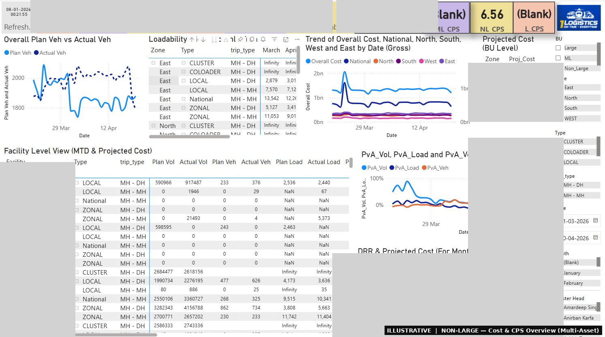
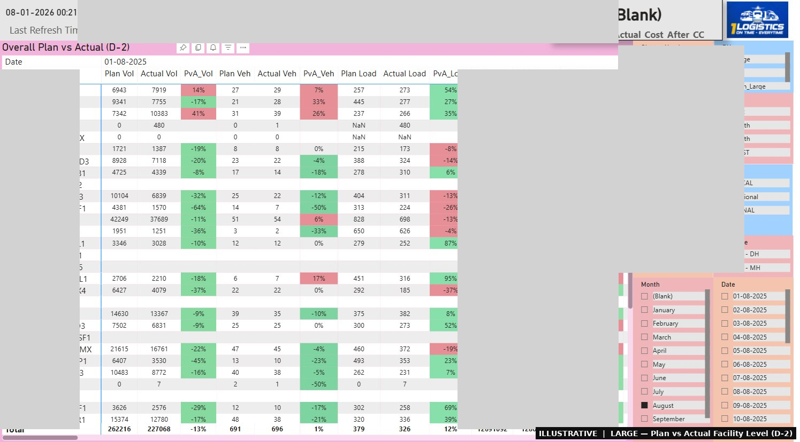
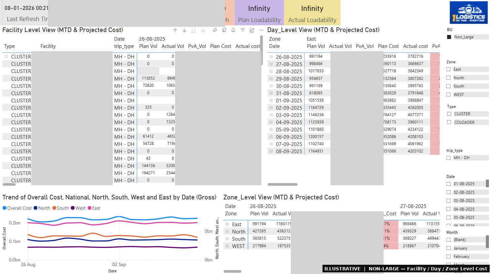

# 💰 Daily Cost Visibility Dashboard

## Use Case
Central ops team had no real-time view of daily cost deviations across Non-Large, Large, and Myntra assets — data lived in separate trackers and required manual consolidation before any analysis.

## How It Helped
Built a multi-asset Power BI dashboard pulling live data via IMPORTRANGE from multiple Google Sheets trackers — zero manual refresh. Shows Plan vs Actual at facility, day, and zone level with projected monthly cost and CPS trends across all three asset types.

## My Role
Designed the data architecture, built the IMPORTRANGE consolidation layer, and developed the full Power BI report covering NL, Large, and Myntra in one unified view.

## Views

**NL Cost Overview** — Facility-level MTD cost, BU-wise projected cost, CPS KPIs (ML/NL/L), and loadability table across all assets in one view.

**Large Plan vs Actual** — Facility-level Plan vs Actual for volume, vehicles, loadability and cost with PvA% colour-coded green/red at a glance.

**Facility / Day / Zone Level** — Granular MTD cost drill-down at facility, daily, and zone level with trend chart and projected cost comparison.

## Output
Daily-refreshing dashboard across NL, Large & Myntra — Plan vs Actual deviations, projected monthly cost, CPS by asset type, and Last Refresh Time displayed on every page.

---
*Power BI · Google Sheets · IMPORTRANGE*
